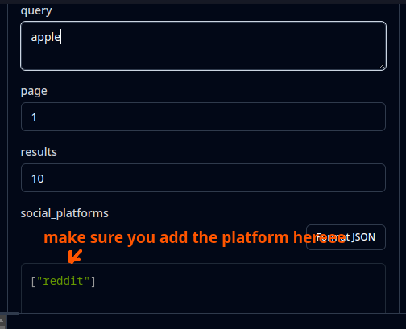

# How to Use PostCrawl MCP Server with MCP Inspector

This guide shows you how to connect to and use the PostCrawl MCP server using MCP Inspector.

## Step-by-Step Instructions

### 1. Install MCP Inspector

Install the MCP Inspector from the [official docs](https://modelcontextprotocol.io/docs/tools/inspector)

### 2. Launch MCP Inspector

Run this command and get the local URL:

```bash
npx @modelcontextprotocol/inspector
```


### 3. Open Inspector Interface

Go to the URL from step 2 and select `Streamable HTTP` for `Transport Type` from the top left:


### 4. Enter Server URL

Provide `https://postcrawl.com/mcp` in the `URL` field:


⚠️ **IMPORTANT**: Use `https://postcrawl.com/mcp` NOT `https://edge.postcrawl.com/mcp`

### 5. Set Up Authentication

Expand the `Authentication` section and create an API key from [PostCrawl platform](https://platform.postcrawl.com/ideaape-pll49AK/settings/api-keys):

- Copy your API Key and paste it in Bearer Token field
- Add `Authorization` in the `Header Name` field


### 6. Connect

Click connect and you're ready to go:


### 7. View Available Tools

Once connected, you can see the tools by clicking here:


### 8. Select a Tool

Click on any of the tools:


### 9. Configure Parameters

Provide your query and make sure to include the social_platforms parameter:



### 10. Run Tool

Click `run_tool` and see the results! 🚀


## Key Points

- Always use `https://postcrawl.com/mcp` as the server URL
- Include `social_platforms` parameter (e.g., `["reddit", "tiktok"]`)
- The `Authorization` header name is required for authentication
- Use your actual PostCrawl API key as the Bearer token